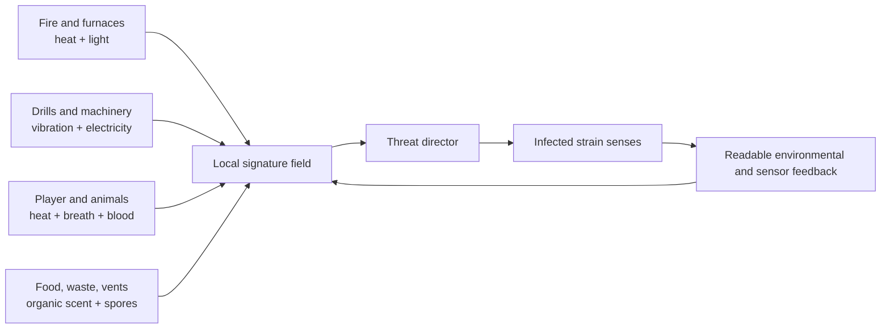
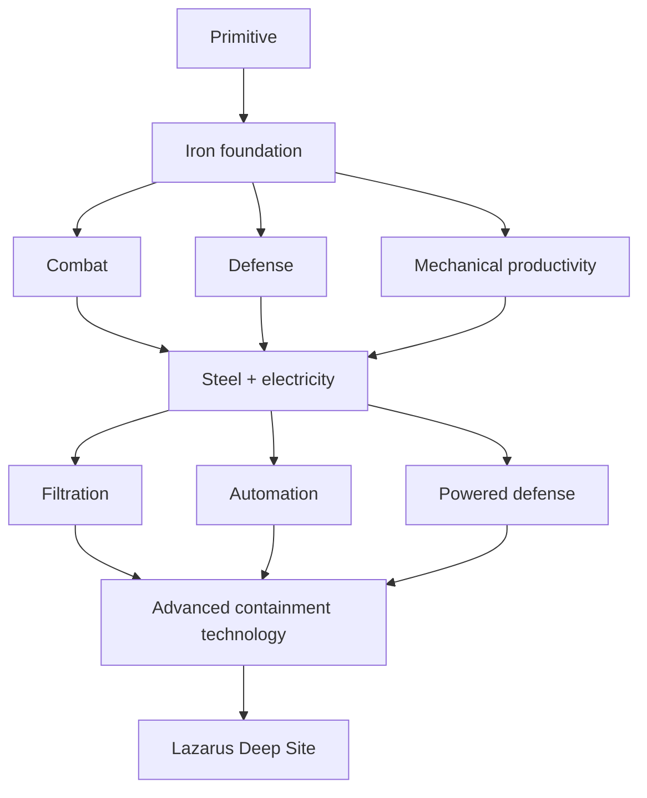
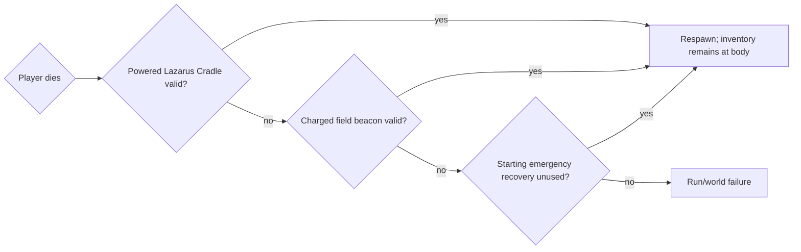
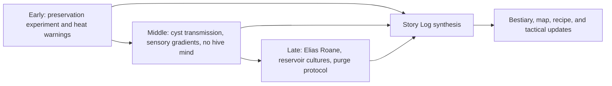
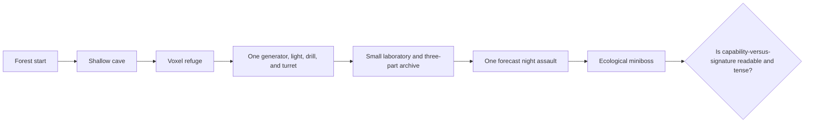

# Contents

- Document Purpose
- 1. Executive Definition
- 2. Design Pillars
- 3. Core Loops and Objectives
- 4. World Model: 3D Voxel Environment
- 5. Infection Ecology and Threat Signatures
- 6. Day, Night, and the Threat Director
- 7. Sanity and Neural Instability
- 8. Survival, Food, and Recovery
- 9. Building the Refuge
- 10. Electricity, Heat, and Automation
- 11. Technology Progression and Player Choice
- 12. Combat and Infected Roles
- 13. Death, Recovery, and Persistence
- 14. Scoring and Valley Reclamation
- 15. Lore Bible
- 16. Story Delivery and the Story Log
- 17. Regional Containment Infrastructure
- 18. The Lazarus Deep Site and Final Encounter
- 19. Post-game Reclamation
- 20. User Interface and Feedback
- 21. Save and Persistence Requirements
- 22. Data-driven Configuration
- 23. Suggested System Architecture
- 24. Vertical Slice
- 25. Development Roadmap
- 26. Acceptance Criteria
- 27. Tunable Values and Remaining Decisions
- Appendix A. Consolidated Requirement Index
- Appendix B. Agent Implementation Priorities

# Document Purpose

This document is the consolidated design baseline for **Infection's Wake**. It replaces the initial 2D specification and incorporates the accepted revisions from the critical design review, the biological Project Lazarus lore, and the move to a **3D voxel world** comparable in broad spatial form to *Minecraft* and *Vintage Story*.

It is written for two audiences:

1. A human designer, reviewer, or developer who needs a coherent picture of the intended game.
2. A software agent or implementation team that needs explicit requirements, system boundaries, state rules, milestones, and acceptance criteria.

The public game title remains **Infection's Wake**. **Project Lazarus** is an in-world medical research program, not the title of the game.

## Version 2 decisions

- The world is now a first-person **3D voxel sandbox**, not a 2D side-scroller.
- Infection ecology is the unifying design system.
- Night pressure uses one forecast major assault plus conditional incursions, rather than automatic waves every five minutes.
- Sanity is biologically grounded and entirely harmful. Low sanity has no tactical benefit.
- Hallucinations may include false generator alarms, misleading sensor traces, phantom motion, and false enemies.
- A recovery device must be intact and powered at the moment of death. A power failure is a valid player-caused failure, not something the system protects against with a hidden reserve.
- Default play uses staged recovery so early learning deaths are setbacks rather than immediate total deletion. A run still fails if every recovery layer is unavailable. Hardcore mode may use the original harsher rule from the start.
- The original "ancient machine" is replaced by regional Project Lazarus containment and transit infrastructure.
- The final encounter is a reservoir ecosystem containing the remnants of Elias Roane. It is not a hive mind and does not command the infected.
- Lore is developed to a **concept-bible level**: rules, timeline, characters, locations, reveal sequence, and final objective are defined. Most individual journals, radio scripts, and environmental scenes remain future content.

# 1. Executive Definition

## 1.1 One-sentence game promise

**Begin as a vulnerable scavenger in a ruined voxel valley, build an industrial refuge whose heat, vibration, blood, breath, and electricity make it increasingly visible to a blind bacterial ecology, learn how that ecology senses the world, and redesign both your base and your behavior well enough to purge its regional source.**

## 1.2 Genre and product definition

- **Genre:** 3D voxel survival sandbox with crafting, automation, base defense, exploration, biological horror, and authored progression.
- **Perspective:** First-person for the initial release.
- **Primary mode:** Single-player.
- **World:** Procedurally generated, persistent, destructible, and buildable voxel terrain.
- **Session structure:** Persistent save with day-night cycles, escalating regional progression, a final containment objective, and a continuing reclamation endgame.
- **Core inspirations:** The free construction and world persistence of voxel sandboxes, the production and power choices of factory games, and the readable preparation of survival defense games.
- **Non-goal:** The game is not intended to reproduce the full feature set or exact combat, logistics, or progression of any inspiration.

## 1.3 Player fantasy

The player begins with no tools and little knowledge. Over time, the player becomes capable of operating a refuge that can mine, smelt, filter air, store food, generate electricity, sense infected movement, and defend itself. Every gain in capability creates new signals that the infection can detect. Mastery comes from controlling those signals rather than merely increasing damage output.


# 2. Design Pillars

Every major feature must reinforce at least one pillar. Features that reinforce none should be delayed or removed.

## 2.1 Capability has a signature

Fire, blood, warm bodies, livestock, furnaces, drills, lights, generators, cables, vents, and waste all change what the infected can detect. Progression solves problems while creating new exposure.

**Design test:** Does the feature create a readable choice between capability and visibility?

## 2.2 The base is a living system

A strong base is not merely a thick box. Power, ventilation, heat flow, filtration, access routes, storage, food processing, structural maintenance, and defense interact. The player manages flows of energy, matter, contamination, and attention.

**Design test:** Does the feature interact with at least one other base system in a way the player can understand and redesign?

## 2.3 Knowledge is equipment

Archives and observation reveal what different colonies sense, how cysts travel, which materials insulate vibration, when sterilants work, and why a breach occurred. Knowledge changes map interpretation, bestiary information, recipes, and construction decisions.

**Design test:** Can a player use the knowledge within minutes, without making long prose mandatory for basic progression?

# 3. Core Loops and Objectives

## 3.1 Immediate survival loop

1. Collect loose stones, sticks, fibers, and edible materials.
2. Craft primitive tools.
3. Obtain wood and make fire.
4. Secure food and clean water.
5. Build a minimal voxel shelter.
6. Observe the first signs that heat, breath, blood, and vibration attract infected organisms.
7. Prepare for the first major night assault.
8. Repair, learn, and expand.

## 3.2 Long-term progression loop

1. Survive with low-signature primitive tools.
2. Build a refuge and learn basic biological attraction rules.
3. Enter iron production and choose an early emphasis: combat, defense, or mechanical productivity.
4. Recover research that explains threat signatures and cyst transmission.
5. Introduce steel and electricity, gaining automation while creating a new attraction class.
6. Explore laboratories, mines, and industrial ruins to control contamination and restore infrastructure.
7. Restore the regional containment transit system and survive the signature of its activation.
8. Enter the Lazarus Deep Site, operate three purge systems, and destroy the valley's durable strain reservoir.
9. Continue in a reclamation endgame at a fixed maximum enemy tier.

## 3.3 Main objective

The authored campaign objective is to purge the regional Project Lazarus reservoir beneath the Deep Site. This is accomplished through exploration, industrial progression, archive research, transit restoration, three manual purge operations, and a final reservoir viability encounter.

## 3.4 Endless survival objective

The save continues after the reservoir is purged. Players may improve the refuge, reclaim contaminated regions, complete the archive, build regional infrastructure, survive additional major assaults, and pursue optional score records.

# 4. World Model: 3D Voxel Environment

## 4.1 Voxel requirements

**WORLD-001:** The world shall use a three-dimensional block grid with destructible and placeable terrain.

**WORLD-002:** Terrain edits, tunnels, structures, machines, wiring, storage, contamination, and discovered locations shall persist in the save.

**WORLD-003:** World generation shall be chunked and streamable. Exact chunk dimensions are engine-specific, but the save format must identify chunks independently for loading, migration, and repair.

**WORLD-004:** The player shall be able to mine horizontally and vertically, create underground facilities, bridge gaps, build towers, roof structures, and route utilities through constructed spaces.

**WORLD-005:** Enemies shall not appear inside a properly sealed room without an established route such as an open path, a breached voxel, a contaminated vent, a burrow path, or a previously established cyst growth.

## 4.2 Initial physical rules

- Solid blocks support construction.
- Loose materials such as sand, gravel, and unstable rubble may fall when unsupported.
- Full structural engineering collapse is not required for the vertical slice.
- Doors, hatches, vents, windows, grates, pipes, and cable pass-throughs are explicit blocks or placed entities.
- Liquids may be simplified initially, but water flow and flooding are required for the final Deep Site sequence.
- Fire spreads only through authored flammability rules and should not create uncontrolled whole-world simulation in the first release.

## 4.3 Biomes and regions

### Forest

Starting resources, animals, timber, surface water, low-tier infected, and good early concealment. Dense vegetation reduces long sightlines but may hide approach routes.

### Plains

Open construction space, farms, long sightlines, and greater exposure. Suitable for large power and production sites if the player accepts visibility.

### Cave networks

Primary ore source. Caves include vertical shafts, water pockets, unstable rubble, infected nests, and mineral-rich colonies. Deep machinery produces vibration that may attract burrowers or vibration-sensitive packs.

### Industrial ruins

Sources of machine components, conductors, pumps, generators, and production infrastructure. Restoring a facility should change the region rather than merely award a recipe.

### Abandoned settlements and city blocks

Dense salvage and human traces, but complicated approach paths, interior cyst contamination, and high background noise. Large city content is deferred until after the vertical slice.

### Project Lazarus laboratories

Contain research archives, filtration technology, antibiotics, sterilants, advanced components, and ecological encounters. Laboratories are the main bridge between lore and practical knowledge.

### Lazarus Deep Site

A hardened underground containment complex accessed through restored regional infrastructure. It contains the three sterilization galleries, reservoir vault, and final authored encounter.

# 5. Infection Ecology and Threat Signatures

## 5.1 Foundational rule

The infection has no central intelligence, psychic network, or commanding organism. Each bacterial colony responds independently to physical and chemical gradients. Large groups can appear purposeful because many colonies react to the same signal.

## 5.2 Signature channels

The simulation shall support at least these channels:

- **Heat:** Fires, furnaces, generators, bodies, and livestock. Counter with insulation, distance, cooling, and intermittent operation.
- **Light:** Fires, windows, and exterior lamps. Counter with shutters, baffling, low-leak fixtures, and selective use.
- **Vibration:** Mining, drills, impacts, engines, and collapsing blocks. Counter with isolation mounts, bedrock placement, scheduling, and dampers.
- **Breath / CO2:** The player, animals, and enclosed occupied rooms. Counter with ventilation routing, scrubbers, distance, and airlocks.
- **Blood / organic scent:** Combat, slaughter, corpses, raw food, and waste. Counter with cleaning, sealed processing, cold storage, and drainage.
- **Spores / cysts:** Nests, infected vents, and contaminated bodies. Counter with filtration, sterilants, cold, and sealed disposal.
- **Electrical activity:** Generators, cables, motors, and turrets. Counter with shielding, underground routing, switched circuits, and distance.
- **Metal chemistry:** Exposed iron, copper, batteries, and damaged machines. Counter with casing, storage, maintenance, and decoys.

## 5.3 Signature field

Each source emits one or more signature values. The world combines them into local fields affected by:

- Distance
- Voxel material
- Open air versus enclosed spaces
- Weather
- Temperature
- Insulation
- Ventilation direction
- Water
- Soil and bedrock
- Active filtration
- Damage state

The implementation may approximate these fields by chunk, cell, room, or sampled propagation graph rather than simulating continuous fluid dynamics.

## 5.4 Infected sensing

Each strain has a weighted sensory profile. An infected creature does not know where a machine is. It selects a stimulus it can detect and follows the local gradient until it loses the signal, encounters a stronger signal, or gains direct visual or contact information.

Example profile:

```yaml
strain: machine_eater
senses:
  heat: 0.7
  vibration: 0.8
  electrical: 1.0
  blood: 0.2
  co2: 0.1
thresholds:
  investigate: 0.25
  pursue: 0.55
  frenzy: 0.85
```

## 5.5 Mechanical legibility

The player must be able to understand why infected chose a target.

Early feedback:

- Infected heads turn toward a running machine.
- Insects or small animals leave a contaminated vent.
- Condensation forms around a cold leak or warm wall.
- Clicking cysts intensify before a breach.
- Tracks and disturbed soil point toward a vibration route.

Later feedback:

- Heat overlay
- Vibration sensor
- CO2 or airflow tracer
- Spore detector
- Electrical-field probe
- Threat forecast report





# 6. Day, Night, and the Threat Director

## 6.1 Design intent

Night must create a meaningful preparation rhythm without interrupting building every few minutes. The player should have long stretches for construction, exploration, and production while still feeling a rising, readable threat.

## 6.2 Daily cadence

- Daytime favors exploration, construction, repairs, farming, and lower-risk production.
- Dusk begins a clearly telegraphed preparation period.
- Each night contains **one major assault window**.
- Smaller incursions may occur at any time when the player produces a strong signature or leaves a local nest unresolved.
- Dawn ends the scheduled assault pressure but does not magically remove nearby infected.

## 6.3 Threat director inputs

The director considers:

- Day count and campaign stage
- Biome and local population capacity
- Active generators, drills, furnaces, lights, and turrets
- Recent combat and bloodshed
- Player and livestock concentration
- Light leakage
- Noise and vibration history
- Contaminated vents and unresolved nests
- Weather and temperature
- Recently sterilized or reclaimed zones
- Sanity-related bacterial shedding and sensory impairment

## 6.4 Threat events

### Scouts

Small groups that investigate a specific signature. They test whether the player notices causal feedback.

### Conditional incursion

A focused attack caused by a high signature, such as a drill running beneath soft soil or a carcass left near the base.

### Major night assault

The primary nightly defense event. Its composition asks a specific defensive question rather than only increasing enemy quantity.

### Reservoir migration

A rare high-tier event involving a large movement from a contaminated site. It is forecast through environmental signs or instruments.

## 6.5 Wave questions

Examples include:

- Heat-seekers punish exposed generators.
- Cyst carriers test ventilation and filtration.
- Climbers test roofs, towers, and exterior surfaces.
- Burrowers follow sustained vibration through soft soil.
- Brutes attack foundations and reinforced doors.
- Ranged infected suppress exposed turret nests.
- Machine eaters follow electrical and metal signatures.

## 6.6 Forecast UI

The side HUD replaces the original repeating five-minute wave meter with a threat panel showing:

- Current night threat level
- Estimated major assault time
- Forecast confidence
- Dominant observed signatures
- Known strain indicators
- Active incursion alert
- Remaining hostiles during a major assault

Forecasts may be imperfect because of limited instruments, weather, and low sanity, but basic timing should remain usable.

## 6.7 Repair burden

Ordinary assaults should consume resources and reveal weaknesses without forcing a complete rebuild. Support systems include:

- Modular wall and utility segments
- Repair priority settings
- Late-iron maintenance bench that repairs connected structures from stored materials
- Replaceable fuses and cable junctions
- Persistent scars and damaged surfaces
- Rare catastrophic breaches that become memorable events

# 7. Sanity and Neural Instability

## 7.1 Naming

The player-facing HUD uses **Sanity**, matching the established design language. Scientific archives describe the same condition as **neural instability** caused by bacterial neurotoxins, inflammation, sleep deprivation, contaminated air, and low-level colonization.

## 7.2 Design rule

Sanity is entirely negative. The player receives no enhanced senses, damage bonus, hidden perception, or other benefit from low sanity.

## 7.3 Value and causes

Sanity ranges from 0 to 100.

Sanity decreases through:

- Night exposure
- Sleep deprivation
- Cyst clouds and contaminated interiors
- Poor ventilation
- Nearby infected tissue or reservoirs
- Severe injury and blood loss
- Certain laboratory chemicals or enemy attacks
- Prolonged darkness

Sanity increases through:

- Daylight
- Safe sleep
- Stable powered lighting
- Clean air and filtration
- Antibiotics or suppressants
- Reduced cyst exposure
- Secure, low-threat shelter conditions

## 7.4 Threshold behavior

### 51-100: Stable

- Reliable perception
- Ordinary regional spawning and attraction rules

### 26-50: Unstable

- Daytime infected pressure may increase because elevated bacterial burden and shedding create a stronger signature.
- The director must draw these infected from valid nearby populations or routes; it must not conjure enemies inside sealed spaces.
- Occasional false sounds, phantom movement, or incorrect low-priority alerts may occur.

### 1-25: Hallucinating

- False enemies may appear among real threats.
- A verified strike causes a false enemy to flicker and disappear.
- False enemies cannot deal real damage.
- Generator alarms, footsteps, heat traces, item silhouettes, or machine-state indicators may be false.
- Physical gauges and high-tier instruments provide verification cues.
- Daytime pressure remains elevated through ordinary ecology and attraction rules.

### 0: Collapse state

- Hallucinations and misinformation become frequent.
- Maximum-tier strains may respond to the player's extreme biological signature if those strains have a valid regional source and route.
- The player does **not** take automatic continuous health damage solely for being at zero sanity.
- The state remains recoverable through shelter, clean air, sleep, suppressants, and treatment.

## 7.5 Accessibility

Players may reduce distortion, disable flashing, separate hallucination audio volume, add stronger verification cues, and replace visual warping with less intense indicators. Accessibility options must not remove the underlying gameplay cost unless a difficulty option explicitly does so.

# 8. Survival, Food, and Recovery

## 8.1 Food scope

Food is a meaningful support system but not a deep nutrition simulation in the initial release.

- Hunger or energy should decline slowly enough not to interrupt every expedition.
- Better meals improve health recovery and sleep quality.
- Raw meat, slaughter, exposed waste, and warm storage produce biological signatures.
- Sealed storage and cold rooms reduce scent but consume materials or power.
- Smoking and cooking reduce contamination while producing heat and exhaust.
- Clean water and filtration matter more in contaminated regions.

## 8.2 Animals and farming

Animals provide food and materials but emit heat, breath, waste, and noise. Indoor livestock creates a defensible resource and a threat-management problem. Full breeding simulation and large crop systems are deferred until the core loop is proven.

## 8.3 Sleeping

Beds restore sanity and advance time only when the shelter is sufficiently secure. Sleep may be blocked by nearby active threats, severe contamination, fire, or critical power failure. Beds do not establish the respawn point.

# 9. Building the Refuge

## 9.1 Building capabilities

Players can construct:

- Foundations, floors, walls, roofs, towers, bridges, and tunnels
- Doors, hatches, shutters, windows, and grates
- Vents, ducts, filters, chimneys, and airlocks
- Storage, workbenches, furnaces, and food-processing areas
- Traps, barriers, turrets, and observation points
- Generators, batteries, cables, switches, sensors, and lights
- Drills, pumps, transfer systems, and production machines
- Beds, medical stations, and recovery devices

## 9.2 Base diversity in 3D

The 3D world should prevent one universal kill corridor by supporting multiple readable attack domains:

- Surface approach
- Roof and wall climbing
- Underground vibration routes
- Vent and cyst contamination
- Ranged line of sight
- Foundation attack
- Water or drainage routes
- Interior breaches created by prior contamination

Every breach must be attributable to an actual route or neglected system.

## 9.3 Rooms and environmental zones

The simulation may identify enclosed room volumes for:

- Temperature
- Air quality
- CO2
- Spore concentration
- Light leakage
- Pressure or airflow
- Machine heat

Exact fluid simulation is unnecessary. A graph of connected room volumes, vents, doors, and exterior openings is acceptable.

## 9.4 Defensive domains

- **Reinforced wall:** Strong against ordinary melee and runners; limited by foundation attacks, climbers, brutes, and vents.
- **Roof overhang:** Strong against climbers; limited by ranged infected and burrowers.
- **Trap lane:** Strong against predictable surface approaches; limited by friendly movement, maintenance burden, and alternate routes.
- **Warm-body turret:** Strong against active infected bodies; limited by cold cyst masses, smoke, and blocked line of sight.
- **Vibration turret:** Strong against burrowers and heavy movement; may confuse livestock or machinery.
- **UV sterilizer:** Strong against cysts and exposed colony film; requires power and line of sight and has limited effect on deep tissue.
- **Filtered vent:** Strong against airborne cysts; limited by clogging, maintenance, and active-filtration power demand.

# 10. Electricity, Heat, and Automation

## 10.1 Electricity tier

Electricity begins with steel-level industry. It is powerful and conspicuous.

Required components:

- Generators
- Conductive wiring
- Switches and junctions
- Batteries or storage
- Consumers
- Network status display
- Fuses or overload protection

## 10.2 Power behavior

- Consumers stop when disconnected or underpowered.
- Priority groups allow the player to preserve critical systems.
- Generators create heat, vibration, exhaust, fuel demand, and electrical signature.
- Batteries allow scheduled operation but create a high-value metal target.
- Cable routes may be shielded, buried, or separated from living areas.

## 10.3 Machines

### Drill

- Requires placement on a valid ore body or mining face.
- Produces ore, vibration, heat, and noise.
- Stops when unpowered, blocked, damaged, or full.
- Can be mounted on vibration isolation at additional cost.

### Furnace and kiln

- Convert ore into metal.
- Produce heat and exhaust.
- Advanced furnaces may be restored industrial infrastructure rather than crafted portable blocks.

### Turret

- Controls a domain rather than solving all combat.
- Has target-class rules, blind spots, heat buildup, ammunition or energy needs, and maintenance requirements.
- The player handles mobile threats, emergency breaches, and priority targets.

### Maintenance bench

- Slowly repairs connected structures using stored materials.
- Does not replace faster manual emergency repair.

### Transfer and storage

- The full game may support conveyors, chutes, pipes, or item networks.
- The vertical slice needs only readable output storage and short-range transfer.

## 10.4 Automation balance

Automation must create decisions rather than merely remove labor. A machine should improve output while requiring some combination of:

- Power
- Heat management
- Maintenance
- Input logistics
- Output storage
- Defensive coverage
- Signature control

# 11. Technology Progression and Player Choice

## 11.1 Tier structure

### Primitive

Stone tools, fire, basic shelter, hunting, hand crafting, simple traps, and low-signature survival.

### Iron foundation

Smelting, durable tools, improved weapons, reinforced blocks, pumps, basic mechanical devices, and the field recovery beacon.

Within iron, players may emphasize:

- Combat and armor
- Defensive metallurgy and repair
- Mechanical productivity and access

### Steel and electricity

Steel structures, generators, wiring, powered lights, batteries, drills, sensors, turrets, filtration, and the Lazarus Cradle.

Within steel, players may emphasize:

- Filtration and contamination control
- Automation and production
- Powered defense and sensing

### Advanced containment technology

Portable power, field sterilizers, industrial restoration, Deep Site access equipment, high-grade filtration, and regional infrastructure.





## 11.2 Branching rule

Progression eventually requires broad capability, but the order and emphasis may differ. Major locations should support more than one preparation strategy where feasible.

Example laboratory access routes:

- Reinforced combat entrance
- Low-signature ventilation route
- Restored power bypass
- Excavated service tunnel

## 11.3 Boss and encounter rewards

Ecological bosses unlock systems by changing a location.

Examples:

- A mineralized cave colony blocks an ore seam; removing it exposes the deposit.
- A tissue-fused kiln host occupies an industrial furnace; victory restores steel production at scale.
- A contaminated pump organism blocks a flooded laboratory; purging it drains the level and opens filtration research.

Bosses should not conveniently carry abstract keys or recipes without environmental explanation.

# 12. Combat and Infected Roles

## 12.1 Combat principles

- Combat is dangerous but not the only valid solution.
- Stealth, scheduling, decoys, sealing, filtration, and route design can reduce encounters.
- Player weapons and infrastructure complement each other.
- Enemy durability has a designed maximum; difficulty comes from composition, terrain, signature, and special behavior rather than infinite health inflation.

## 12.2 Core roles

### Drifter

Standard infected body. Follows warmth, breath, and fresh blood. Attacks accessible barriers and the player.

### Runner

Fast, fragile, and strongly responsive to movement and blood. Pressures exposed players and open doors.

### Brute

Slow, mineralized, and capable of damaging foundations and reinforced blocks.

### Climber

Uses altered joints and hardened fingers to climb voxel faces, scaffolds, trees, and exterior structures.

### Burrower

Follows sustained vibration through soil, rubble, and soft stone. Cannot tunnel through all materials and must leave readable disturbance.

### Cyst carrier

Spreads airborne or surface cysts. Threatens vents, filters, and contaminated interior zones.

### Machine eater

Strongly follows heat, electrical fields, metal chemistry, and machine vibration.

### Ranged infected

Expels contaminated fluid, hardened fragments, or cyst masses. Creates pressure against exposed firing platforms.

### Elite strain

Combines two or more roles. Appears only when campaign stage, local ecology, or zero-sanity attraction provides a valid source.

## 12.3 AI target selection

Infected choose between:

1. Directly sensed living targets
2. Strong signature gradients
3. Obstacles blocking the chosen gradient
4. Defensive systems actively damaging them
5. Nearby exposed biological or metallic resources

They do not receive perfect knowledge of hidden player assets.

# 13. Death, Recovery, and Persistence

## 13.1 Design intent

Death must create loss, retrieval pressure, and infrastructure consequences without making the first learning mistake erase hours of world building by default.

## 13.2 Recovery ladder

### Starting refuge emergency recovery

- One weak recovery is attached to the starting refuge.
- It is fixed, cannot be moved, and is consumed after use.
- It exists to protect the first learning cycle.

### Iron field beacon

- Limited or costly recovery device.
- Requires a consumable biological ampoule or rare component per recovery.
- Has a restricted activation radius or must be manually registered.
- May be damaged or destroyed.

### Steel Lazarus Cradle

- Fully selectable spawn machine.
- Requires a rare continuity component.
- Requires electrical power and an intact connection at the moment of death.
- Only one cradle is active at a time in the initial release.
- It has no guaranteed hidden reserve. If the base loses power before the player dies, the cradle is invalid.
- The HUD must clearly show whether recovery is currently secured.





## 13.3 Failure rule

When the player dies, the game checks the active cradle, then eligible field beacons, then the unused starting recovery. If none is valid, the run fails and the world is no longer an active playable save under normal rules.

A configurable option may archive the failed world for viewing. Hardcore mode may disable the starting recovery and use harsher rules from the beginning.

## 13.4 Inventory recovery

- All carried items remain at the death location in a body or gravestone container.
- Multiple bodies may coexist.
- Bodies remain indefinitely unless the world is reset.
- The map marks known body locations.
- Enemies and contamination remain, so retrieval may require new equipment or an alternate route.

## 13.5 Persistence after valid recovery

The following remain:

- Terrain edits
- Buildings and machines
- Tunnels and roads
- Storage not carried by the player
- Power and ventilation networks
- Boss and location states
- Research and archives
- Score and reclamation metrics
- Contamination and sterilization states
- Deep Site progression

# 14. Scoring and Valley Reclamation

## 14.1 Core progression metric

The main persistent measure is **Valley Recovery**, not kill score.

It tracks:

- Regions surveyed
- Contaminated sites sterilized
- Nests and reservoirs removed
- Stable power uptime
- Archives recovered
- Infrastructure restored
- Safe routes established
- Highest defended night
- Deep Site completion

## 14.2 Survival score

The original point system remains as an optional challenge and optimization layer.

Provisional scoring sources:

- Days survived
- Infected defeated
- Assaults completed
- Bosses and ecological encounters
- Efficient power use
- Low-damage defenses
- Challenge modifiers

Combat score must not make avoidance, efficient defenses, or sterilization feel inferior to repetitive killing.

# 15. Lore Bible

## 15.1 Required degree of lore development

The lore should be developed enough to enforce consistent game rules and support environmental storytelling, but not so completely that production is burdened by a novel-length canon before the core loop is proven.

This specification fixes:

- The infection's origin and durable fictional rules
- The absence of a hive mind
- Key people and locations
- The broad outbreak timeline
- The reason the final site matters
- The three-stage revelation structure
- The emotional role of distant survivors

It deliberately leaves most individual documents, recordings, local stories, and exact dates for later writing.

## 15.2 Project Lazarus

Project Lazarus was a medical preservation program intended to keep catastrophically injured patients alive long enough to receive definitive treatment. Its experimental organism, **LZ-9**, was an engineered bacterium assembled from six harmless strains and an extremophile recovered from a poisoned mine.

LZ-9 was designed to:

- Consume damaged tissue
- Seal ruptured vessels with fibrous biofilm
- Reduce destructive inflammation
- Preserve muscle and peripheral nerve pathways
- Use trace metals to create conductive structures
- Maintain damaged organs temporarily after severe trauma

The project's standing rule was: **Preservation is not revival.**

## 15.3 Durable fictional biology

The science is speculative but follows a small number of consistent rules:

1. **Conductive biofilm:** Colonies can bridge damaged peripheral motor pathways and trigger crude repeated movement.
2. **Preservation without consciousness:** The bacterium does not restore personality, memory, or cortical function.
3. **Gradient-following behavior:** Colonized bodies respond to heat, carbon dioxide, blood chemistry, vibration, electrical activity, salt, and metals.
4. **Cyst transmission:** A later strain forms dry cysts in lungs, throat, wounds, vents, and contaminated surfaces.
5. **Selection and adaptation:** Different environments favor distinct strains; there is no purposeful mutation or central plan.
6. **Environmental reservoirs:** Warm nutrient-rich infrastructure can sustain colonies for years and generate durable local strains.

The game should show consequences rather than repeatedly explain biomedical detail.

## 15.4 Elias Roane / Subject L-01

Elias Roane was brought to Ward Seven after a mining or excavation accident crushed his chest. He received a concentrated LZ-9 treatment. His circulation briefly returned, but consciousness did not.

After clinical death, Roane's body moved because bacterial biofilm preserved and stimulated lower motor pathways. His colony developed dry cyst transmission and became the source of the most durable regional laboratory strains.

Roane is tragic evidence, not a villain. Whatever person he was is absent.

## 15.5 Containment failure

Roane's strain spread through ventilation after filters clogged and staff overrode pressure controls. Infected patients remained mobile through injuries, lost pain responses, and eventually continued under simpler motor patterns after higher brain function failed.

The outbreak escaped the clinical annex and contaminated the valley. The event occurred roughly a decade or more before the game; the exact year remains a narrative tuning decision.

## 15.6 Mara Venn

Dr. Mara Venn was a Project Lazarus researcher who documented the preservation experiment, Roane's transformation, sensory behavior, and the final purge protocol. She reached the first sterilization gallery and opened one purge valve before dying.

Her notes are the foundation for the archive sequence, but they should not appear as one early book containing every answer.

## 15.7 The regional reservoir

Roane was moved into the reservoir vault beneath the annex. Over years, the vault became a dense ecosystem of preserved tissue, nutrient film, metal, heat, and bacterial signaling chemicals.

Nearby infected converge on it because it is the strongest physical and chemical source in the region. They are not obeying it.

Purging the reservoir will remove the valley's major source of durable strains and make reclamation possible. It will not cure the world or remotely disable every infected organism.

## 15.8 Emotional continuity

The world should contain sparse evidence of living people without requiring a full NPC settlement simulation.

Approved methods:

- A recurring shortwave radio operator
- Marked supply caches
- Distant lights that change as regions are reclaimed
- One-way requests or warnings
- Automated emergency messages
- Signs that another survivor passed through recently

The radio operator's final identity, name, and fate remain open. The role exists to make regional recovery matter to someone beyond the player.

# 16. Story Delivery and the Story Log

## 16.1 Archive action

Collectible documents are **cataloged**, not consumed.

On first use:

1. The player opens a confirmation card.
2. The content is added permanently to the Story Log.
3. The physical item becomes a cataloged variant that may be kept, placed on a shelf, or discarded.
4. Duplicate copies provide no additional progression credit.

## 16.2 Archive reward levels

### Atmospheric

Adds human detail, location history, or mood. No direct mechanical requirement.

### Tactical

Reveals optional advantages such as a strain's sensory weights, a sterilant, a safe route, or a filtration method.

### Progression

Establishes an objective or facility function. The game summarizes the essential action in the quest and map UI after discovery; critical instructions are not buried only in long prose.

## 16.3 Story Log as research instrument

The log updates:

- Bestiary behavior
- Signature overlays
- Map annotations
- Recipe hints
- Sterilization methods
- Facility diagrams
- Objective summaries
- Archive synthesis entries

## 16.4 The First Wake reveal sequence

The existing lore is split into at least three discoveries.

### Early discovery: Preservation Ward fragments

Reveals:

- Project Lazarus was intended for temporary preservation.
- Staff were warned not to use heated blankets near certain patients.
- A clinically dead body moved without evidence of consciousness.

Gameplay value:

- Introduces heat attraction.
- Establishes preservation without revival.

### Mid-game discovery: Ventilation incident records

Reveals:

- Dry cyst transmission
- Filter clogging
- Attraction to heat, breath, blood, vibration, and electrical activity
- Colonies act independently and do not share a mind

Gameplay value:

- Unlocks filtration notes, spore detection, and improved threat interpretation.

### Late discovery: Venn's reservoir protocol

Reveals:

- Elias Roane's identity
- Why the reservoir attracts infected without commanding them
- The regional significance of the durable cultures
- The three sterilization galleries and purge valves

Gameplay value:

- Defines the final objective and updates the Deep Site map.

After all fragments are cataloged, the Story Log assembles a synthesized entry titled **The First Wake**.





# 17. Regional Containment Infrastructure

## 17.1 Replacement for the ancient machine

The late-game access system is a buried Project Lazarus regional containment and transit network. It may include:

- Pressure-sealed rail
- Decontamination shaft
- Water-powered emergency turbines
- Sterilization pumps
- Bulkhead controls
- Surface relay stations

The system survived because it was hardened against contamination, blast, flood, and structural collapse. It does not require an ancient civilization or supernatural technology.

## 17.2 Restoration requirements

The player must restore:

- Mechanical access
- Power generation or turbine flow
- Control relays
- Filtration
- Pressure seals
- At least one defended surface station

Components come from laboratories, industrial ruins, ecological encounters, and advanced manufacturing.

## 17.3 Activation siege

Starting the transit system creates an extreme regional signature through vibration, electricity, heat, and moving machinery. The player must defend the restoration site during a final surface assault before entering the Deep Site.

# 18. The Lazarus Deep Site and Final Encounter

## 18.1 Final-area design test

The Deep Site must test the whole game: expedition preparation, construction, portable power, filtration, route planning, knowledge, combat, and emergency defense.

## 18.2 Expedition constraints

- The player may place temporary infrastructure in designated or physically plausible areas.
- The full surface base cannot simply be copied underground.
- Portable power, batteries, cable routing, pumps, filters, barricades, and supply caches matter.
- Some rooms remain contaminated or flooded until systems are restored.

## 18.3 Three purge galleries

### Purge valve one: Heat regulation

Opening the first valve disables or destabilizes heat regulation. Warm machinery becomes highly attractive. The player must reroute power, reduce heat, or defend active equipment.

### Purge valve two: Sterilant release

The second valve releases a sterilant that damages exposed colony tissue but also corrodes or disables unprotected electronics. The player must shield, relocate, or temporarily shut down equipment.

### Purge valve three: Reservoir flood

The third valve floods the reservoir system. The player must preserve enough power for pumps, doors, or transit escape while surviving displaced infected organisms.

## 18.4 Final reservoir encounter

The boss health display represents **Reservoir Viability**, not Roane's consciousness.

The arena contains:

- Preserved tissue and biofilm
- Metal and medical equipment fused into colony structures
- Local infected drawn by heat and chemicals
- Roane's remaining human outline as tragic evidence
- Pumps, pressure systems, sterilant, and purge routes

The player wins by completing environmental purge operations and surviving local tissue responses. Direct weapon damage may create openings or destroy growths but is not the sole victory condition.

## 18.5 Outcome

Purging the reservoir:

- Removes the valley's main durable-strain source
- Reduces future regional pressure
- Unlocks reclamation systems
- Does not globally cure the infection
- Does not cause all infected to collapse


# 19. Post-game Reclamation

Enemy statistics remain capped at the designed maximum. Continued play focuses on horizontal projects:

- Sterilize secondary reservoirs
- Reclaim city blocks and industrial sites
- Complete the archive
- Build long-range power and relay networks
- Construct field sterilizers
- Restore weather, water, or filtration infrastructure
- Establish safe roads and supply stations
- Activate optional challenge modifiers
- Improve Valley Recovery and survival score

Regional sterilization may permanently reduce local spawning without making the entire world safe.

# 20. User Interface and Feedback

## 20.1 Core HUD

- Health
- Sanity
- Hunger or energy
- Temperature or exposure when relevant
- Selected item and ammunition
- Day and time
- Threat forecast panel
- Current score and Valley Recovery summary
- Active recovery status
- Contextual power and air-quality warnings

## 20.2 Recovery status

The UI shall state one of:

- `Recovery secured: Lazarus Cradle powered`
- `Recovery at risk: cradle offline`
- `Field beacon available: 1 charge`
- `Emergency refuge recovery unused`
- `No recovery available`

The system should warn clearly but shall not protect the player from a power loss at the moment of death.

## 20.3 Signature feedback

The player may view simplified meters or overlays for:

- Heat
- Vibration
- Airflow and CO2
- Spores
- Electrical activity
- Blood and organic contamination

Early play relies on environmental cues; advanced overlays require research and equipment.

## 20.4 Sanity misinformation

Low sanity may falsify secondary UI information. Essential accessibility and safety indicators should retain a verification method. Examples:

- A false generator alarm while the physical voltmeter remains steady
- A false heat trace not confirmed by a second sensor
- Phantom footsteps without displaced particles
- A false enemy that disappears after a verified strike

# 21. Save and Persistence Requirements

A save must include:

- Version and migration metadata
- World seed and generation settings
- Chunk-level terrain edits
- Placed blocks and entities
- Player state and inventory
- Bodies and gravestones
- Buildings, machines, and storage
- Power networks and priorities
- Room volumes, ventilation, and contamination
- Signature-relevant machine states
- Day, time, weather, and threat-director state
- Sanity
- Recovery devices and active selection
- Boss and ecological encounter states
- Archive and Story Log progress
- Valley Recovery and score
- Transit restoration and Deep Site state
- Post-game reclamation state

Autosaves should occur at safe transaction boundaries and use temporary files or snapshots to reduce corruption risk.

# 22. Data-driven Configuration

The following shall be editable without changing core code:

- Items and recipes
- Voxel materials and properties
- Signature emissions and attenuation
- Strain sensory weights
- Enemy statistics and behaviors
- Threat-event compositions
- Day-night timings
- Sanity rates and thresholds
- Loot and archive placement
- Machine power, heat, vibration, and maintenance
- Generator output and fuel use
- Turret targeting and heat limits
- Recovery device costs and charges
- Boss encounter phases
- Score and Valley Recovery values
- Accessibility defaults

## 22.1 Example machine definition

```yaml
id: fuel_generator_t1
power_output_kw: 12
fuel_capacity: 40
emissions:
  heat: 0.75
  vibration: 0.55
  electrical: 0.60
  light: 0.10
  exhaust: 0.50
attenuation_tags:
  accepts: [insulation, vibration_mount, exhaust_stack, shielding]
failure_modes: [out_of_fuel, overload, damaged, disconnected]
```

## 22.2 Example threat event definition

```yaml
id: night_heat_question_02
minimum_day: 4
requirements:
  local_heat_signature: 0.55
forecast_tags: [warm_tracks, condensation, heat_seekers]
composition:
  drifter: 10
  runner: 4
  brute: 1
  machine_eater: 2
objective_pressure: [generator, furnace, warm_wall]
```

# 23. Suggested System Architecture

Recommended modules:

- Voxel world generation and chunk streaming
- Block and entity persistence
- Player controller and interaction
- Inventory and crafting
- Building and structural rules
- Room and ventilation graph
- Signature field service
- Threat director
- Infected perception and pathfinding
- Combat and damage
- Power network
- Machines and automation
- Food, water, temperature, and recovery
- Sanity and hallucination presentation
- Death and staged recovery
- Archives and Story Log
- Quest and location state
- Scoring and Valley Recovery
- Save, load, migration, and validation
- UI, accessibility, audio, and visual feedback

## 23.1 Important boundaries

- The threat director requests valid spawns; it does not bypass world-route validation.
- Infected AI reads signature data through a sensory interface rather than directly querying hidden player assets.
- Sanity presentation may falsify player-facing information but shall not corrupt authoritative simulation state.
- Power, ventilation, and signature systems expose data-driven interfaces to machines.
- Boss encounter state is location-owned and persistent.

## 23.2 Performance guidance

- Use hierarchical or regional pathfinding for long-distance attraction.
- Simulate detailed signature gradients near active areas and approximate distant regions.
- Update room and ventilation graphs only when topology changes.
- Batch machine and power updates where possible.
- Save dirty chunks and changed entities rather than rewriting the whole world every autosave.

# 24. Vertical Slice

## 24.1 Purpose

The first playable target is a 30-60 minute slice that answers one question:

**Does a generator make the player meaningfully safer and, for understandable biological reasons, also make survival more dangerous?**

## 24.2 Build now

- Forest and shallow cave
- First-person voxel movement, mining, and block placement
- Stone and iron progression
- Basic shelter and room detection
- One fuel generator and simple wiring
- One powered light, drill, and turret
- Three infected roles
- One major forecast night assault
- Sanity prototype with purely negative misinformation
- One small laboratory
- Three-part archive discovery
- Starting emergency recovery, one field beacon, and body retrieval
- One ecological miniboss
- Minimal Story Log and bestiary updates

## 24.3 Defer until the loop is proven

- Steel and full advanced tier
- Abandoned city biome
- Full farming and hunger simulation
- Complex conveyors and production chains
- Five-plus enemy roles and boss waves
- Final Deep Site and reservoir encounter
- Regional transit component hunt
- Multiple active cradles
- Large crafting tree
- Endless score mode
- Full post-game reclamation network
- Multiplayer architecture





## 24.4 Prototype pass/fail tests

1. **Wave interruption:** Can the player spend ten uninterrupted minutes building or exploring while pressure still rises?
2. **Signature comprehension:** Can players infer why infected chose a generator, carcass, light, vent, or drill without a tutorial paragraph?
3. **Death fairness:** Does a first death feel like a meaningful setback rather than a reason to quit?
4. **Sanity counterplay:** Can players predict and recover from sanity loss, or does it feel random?
5. **Base diversity:** Do different players build meaningfully different 3D defenses?
6. **Automation balance:** Does one generator, drill, and turret create new decisions rather than simply remove labor?
7. **Lore utility:** Does an archive change a concrete player behavior within five minutes?
8. **Boss premise:** Do players describe the ecological encounter as a location problem rather than a monster holding a key?

# 25. Development Roadmap

## Milestone 1: Voxel survival foundation

- Chunked world
- Mining and block placement
- Primitive resources and tools
- Fire, food, shelter
- Basic save/load

## Milestone 2: Infection ecology prototype

- Signature channels
- Three infected roles
- Valid-route spawning
- Basic environmental cues
- One conditional incursion

## Milestone 3: Power and night assault

- Generator, wiring, light, drill, turret
- Threat forecast
- One major night assault
- Machine targeting and readable gradients

## Milestone 4: Sanity, archives, and recovery

- Sanity thresholds and misinformation
- Three-part archive
- Story Log updates
- Starting recovery, field beacon, body retrieval

## Milestone 5: Vertical-slice miniboss

- Small laboratory
- Ecological encounter that changes the location
- Iron branching
- Maintenance bench
- Usability and balance tests

## Milestone 6: Steel, filtration, and advanced regions

- Steel industry
- Full power priorities and batteries
- Filtration, sensors, advanced defenses
- Industrial ruins and additional biomes

## Milestone 7: Transit and Deep Site

- Regional containment infrastructure
- Activation siege
- Portable expedition systems
- Three purge galleries
- Reservoir viability encounter

## Milestone 8: Reclamation endgame

- Secondary reservoirs
- Regional infrastructure projects
- Valley Recovery completion systems
- Optional endurance scoring and modifiers

# 26. Acceptance Criteria

## 26.1 Vertical-slice acceptance

1. The player begins in a forest without tools.
2. The player gathers stones and sticks and crafts primitive tools.
3. The player mines and places blocks in a 3D voxel world.
4. The player builds an enclosed refuge.
5. The player obtains iron and creates at least one iron specialization item.
6. A generator powers a light, drill, and turret.
7. Those machines emit readable heat, vibration, or electrical signatures.
8. Infected choose targets through valid sensory and route rules.
9. The player receives a forecast for one major night assault.
10. The assault tests at least two different defensive domains.
11. Sanity decreases through defined causes and provides no benefit.
12. Low sanity can create false alarms, false traces, phantom movement, and false enemies.
13. Zero sanity does not directly drain health.
14. The first death can use the one-time starting recovery.
15. A later death can use a valid field beacon.
16. Inventory remains at a recoverable body.
17. A small laboratory contains three staged archive fragments.
18. Cataloging archives updates the Story Log and at least one practical system.
19. An ecological miniboss alters a location and unlocks a process.
20. Players can explain why the generator both helped and endangered them.

## 26.2 Full-game acceptance

1. Primitive, iron, steel/electric, and advanced containment progression are playable.
2. Progression supports meaningful ordering or specialization choices.
3. Multiple biomes and laboratories exist in the persistent voxel world.
4. Electricity, heat, ventilation, filtration, automation, and defense interact.
5. Night pressure uses major assaults and conditional incursions rather than fixed five-minute waves.
6. Different infected roles respond to distinct signature channels.
7. The base can be attacked through readable surface, roof, underground, vent, and ranged routes.
8. No enemy appears inside a sealed room without a valid route.
9. The Lazarus Cradle requires a rare component and must be intact and powered at death.
10. Losing cradle power at death can cause recovery failure.
11. If all staged recovery options are unavailable, the run fails.
12. Terrain, buildings, machines, research, and world state persist after a valid recovery.
13. The Project Lazarus origin, Elias Roane, Mara Venn, cyst transmission, and non-hive-mind rule are revealed in stages.
14. The regional containment transit system replaces the generic ancient machine.
15. Transit activation causes a major signature-driven siege.
16. The Deep Site requires portable power, filtration, route building, and staged defense.
17. Three purge valves change the encounter environment.
18. The final health objective represents reservoir viability, not a commanding mind.
19. Purging the reservoir improves the valley but does not globally cure the infection.
20. The save continues at a fixed maximum enemy tier with reclamation goals.

# 27. Tunable Values and Remaining Decisions

The following may be tuned during prototypes without changing the design identity:

- Exact day and night duration
- Major assault timing and forecast accuracy
- Signature propagation radii and update frequency
- Sanity gain and loss rates
- Exact role of ordinary electric light versus UV light
- Iron and steel recipe costs
- Number and cost of field-beacon recoveries
- Rare component name and fiction for the Lazarus Cradle
- Exact outbreak date and elapsed years
- Radio operator identity and fate
- Exact world size and chunk dimensions
- Weather systems included at launch
- Liquid simulation complexity
- Exact number of regional reservoirs in post-game
- Score values and challenge modifiers

The following are **not open** unless deliberately revised:

- 3D voxel world
- First-person initial perspective
- Single-player initial scope
- No hive mind
- Purely negative sanity
- No automatic health drain at zero sanity
- Power required at the moment of cradle-based recovery
- Inventory recovery from a persistent body
- Project Lazarus biological origin
- Reservoir ecosystem as the final encounter
- Continued play after final objective
- Fixed maximum enemy tier

# Appendix A. Consolidated Requirement Index

- **WORLD:** Voxel world, chunks, terrain, rooms, and valid routes.
- **SIG:** Signature channels, propagation, sensing, and feedback.
- **THREAT:** Day-night cadence, incursions, major assaults, and forecasts.
- **SAN:** Sanity and hallucination rules.
- **BASE:** Construction, ventilation, defense, and maintenance.
- **PWR:** Electricity, heat, machines, and automation.
- **PROG:** Technology tiers, branches, and ecological unlocks.
- **COMBAT:** Enemy roles, targeting, and the fixed maximum tier.
- **REC:** Death, staged recovery, cradle power, and body retrieval.
- **LORE:** Project Lazarus canon and reveal sequence.
- **ARCH:** Cataloging, Story Log, and practical knowledge.
- **FINAL:** Transit restoration, purge galleries, and reservoir encounter.
- **POST:** Reclamation and optional endurance scoring.
- **SAVE:** Persistence, migration, and validation.

# Appendix B. Agent Implementation Priorities

An implementation agent should proceed in this order:

1. Build stable voxel interaction and chunk persistence.
2. Implement one signature source and one infected sensory gradient.
3. Prove that the infected reaches the source without hidden knowledge.
4. Add a generator that creates both power and signature.
5. Add one light, one drill, and one turret as power consumers.
6. Build the major-assault forecast and valid-route spawn pipeline.
7. Add room detection and one ventilation or contamination route.
8. Add purely negative sanity misinformation as presentation over authoritative state.
9. Add death, starting recovery, field beacon, and body retrieval.
10. Add the three-part archive and Story Log effects.
11. Build one ecological miniboss that alters a location.
12. Run the vertical-slice tests before expanding content.
